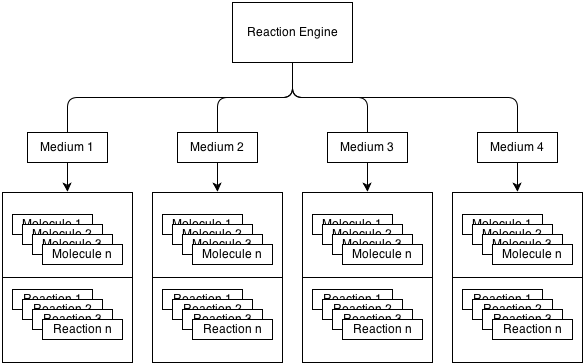

## Reaction Engine : Introduction and Architecture

This reaction engine is a non-stochastic simulator. It's means that it's
only a loop where each turn is a unit of time. At each turn the reaction
engine call a list of reaction and repeat this work as long as needed.

## Architecture

The architecture of this simulator is quite simple.
Mainly there is 4 differents classes :

		- ReactionEngine
		- Medium
		- IReaction
		- Molecule

1. The **ReactionEngine** is everything. It's the master classes that regulate and execute reactions and more.
2. The **Medium** class contains a list of reactions and a list of molecules
3. The **IReaction** class is an interface that inherit each reaction and represent a chemical reaction
   it contains a react() reaction that implements all calculus needed by the reaction.
4. The **Molecule** class represent a molecule. It contains information such as name, actual concentration etc.

This 4 classes are organized like this :

## Processing

At each turn of the loop, the reaction engine call for each of its mediums the function Medium.Update(), this function
call each IReaction.react() functions of it's list of reaction, and at the end modify the concentration of each molecule
of each medium.

